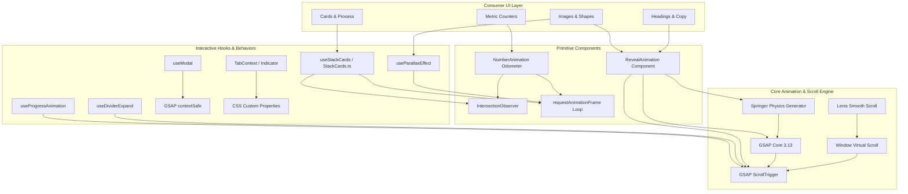

# Animation System Extraction & Implementation Overview

> Comprehensive architectural breakdown, motion language inventory, and production-ready implementation blueprint for recreating the animation, smooth scrolling, and interaction systems in an independent Next.js application.

---

## Table of Contents
1. [Executive Overview](#1-executive-overview)
2. [Detected Technology Stack](#2-detected-technology-stack)
3. [Smooth Scrolling Analysis](#3-smooth-scrolling-analysis)
4. [Animation Inventory](#4-animation-inventory)
5. [Text Reveal System](#5-text-reveal-system)
6. [Scroll Animation System](#6-scroll-animation-system)
7. [Interaction & Transition System](#7-interaction--transition-system)
8. [Reusable Animation Architecture](#8-reusable-animation-architecture)
9. [Dependency Map](#9-dependency-map)
10. [Relevant Files & Code Locations](#10-relevant-files--code-locations)
11. [Reimplementation Folder Structure](#11-reimplementation-folder-structure)
12. [Installation & Setup Requirements](#12-installation--setup-requirements)
13. [Generalized Code Patterns](#13-generalized-code-patterns)
14. [Animation Parameters to Preserve](#14-animation-parameters-to-preserve)
15. [Implementation Checklist](#15-implementation-checklist)
16. [Final Summary](#16-final-summary)

---

## 1. Executive Overview

### Visual & Motion Language Summary
The motion identity of the application is **restrained, modern, and mathematically tuned**, avoiding aggressive or cartoonish bouncing in favor of physical damping and optical elegance. Its core characteristics are:

1. **Blur-to-Sharp Viewport Entrance Choreography**: Rather than relying purely on opacity and position shifts, elements enter the viewport with a dual-stage Gaussian blur filter transition (`blur(16px)` or `blur(20px)` resolving to `blur(0px)`) paired with directional translation and opacity ramping.
2. **Physics-Driven Spring Damping via Numerical Simulation**: Alongside standard GSAP power curves (`power2.out`, `power3.out`), complex entrances leverage an in-house numerical spring simulation step algorithm (`Springer`) computing realistic physical stiffness (tension) and damping (friction) into a custom parametric easing function.
3. **Hardware-Decoupled Smooth Scrolling**: Powered by Lenis v1 (`lenis/react`), normalizing scroll inertia across mouse wheels and trackpads, integrated with Next.js router events to reset scroll on route change and automatically intercept `.lenis-scroll-to` anchor targets with fixed header offsets.
4. **Mechanical Counter & Odometer Rollers**: Key metrics do not simply count numbers upward; they split each digit into isolated, vertical mechanical reels (`0–9`) that rotate upward on individual DOM tracks using easing functions and staggered delays triggered via `IntersectionObserver`.
5. **Progressive Layered Interaction**: The system layers micro-interactions seamlessly—from 3D sticky stack cards scaling downward on scroll, to mouse-following vector parallax scenes, SVG connector stroke expansion, sliding tab indicator lines, and directional button chevron reveals.

---

## 2. Detected Technology Stack

| Technology / Library | Exact Version | Role in Architecture | Implementation Pattern & Reasoning |
| :--- | :--- | :--- | :--- |
| **GSAP (GreenSock)** | `^3.13.0` | Core Animation Engine | Powers all scroll-triggered transitions, height tweens, SVG stroke draws, number tweens, and modal entrances. Chosen for sub-pixel accuracy, tween killing, and timeline control. |
| **@gsap/react** | `^2.1.2` | React Lifecycle Binding | Provides `useGSAP` and `contextSafe` hooks. Guarantees safe cleanup, scoping, and prevents memory leaks during React 19 concurrent renders. |
| **GSAP ScrollTrigger** | `3.13.0` (bundled) | Scroll Event Coordinator | Calculates element viewport visibility, triggering or scrubbing animations at specified trigger points (`top 90%`, `top 50%`, etc.). |
| **Lenis (`lenis/react`)** | `^1.3.8` | Smooth Scrolling Engine | Intercepts native wheel/touch inputs and applies an interpolated virtual scroll layer without hijacking native browser accessibility. |
| **Custom Springer** | Native TS port | Physics Spring Generator | A custom Euler spring step simulation that returns a lookup function `(t: number) => number` directly usable as a GSAP `ease`. |
| **IntersectionObserver** | Web API | Zero-overhead trigger | Used for digit reel rolling (`NumberAnimation`), section tracking (`useActiveSection`), and enabling scroll listeners on sticky cards only when visible. |
| **requestAnimationFrame**| Web API | High-frequency update loop| Throttles mouse parallax calculations (`useParallaxEffect`), sticky card stacking math (`stackCards.ts`), and digit reel DOM updates. |
| **Tailwind CSS v4** | `^4.0.0` | Utility & Variable Styling | Houses CSS transitions, `@theme` tokens, keyframes (`textAnimate`, `top-to-bottom`), and anti-FOUC rules. |
| **Swiper** | `^11.2.10` | Touch Carousel / Slider | Drives testimonials with 3D scale/blur transitions between active and inactive slides. |
| **react-fast-marquee** | `^1.6.5` | Infinite Marquee | Drives smooth ticker banners with pause-on-hover and gradient mask fade edges. |
| **Framer Motion** | *Not present* | *N/A* | **Explicitly not used in this codebase.** All complex animations are handled via GSAP and vanilla CSS transitions. |

### Component Architecture & Lifecycle Pattern
* **Client Boundary Requirement**: All animated components and hooks explicitly declare `'use client'`. Animations requiring DOM measurement execute inside `useGSAP` or `useEffect` after mount.
* **FOUC Prevention Architecture**: Elements wrapped in `<RevealAnimation>` receive a `data-ns-animate="true"` attribute. In `src/styles/common.css`, the rule `[data-ns-animate] { opacity: 0; }` ensures that elements remain invisible prior to JavaScript hydration and GSAP initialization, avoiding flash-of-unstyled-content.

---

## 3. Smooth Scrolling Analysis

### Flow Diagram

```text
User Wheel / Touch / Keyboard Input
               │
               ▼
   Lenis Virtual Scroll Engine (duration: 1.1s)
               │
      Interpolated Scroll Position
               │
       ┌───────┴────────────────────────┐
       ▼                                ▼
DOM Window Scroll              Next.js Navigation Intercept
       │                                │
       ▼                                ▼
ScrollTrigger Recalculation    Route change -> lenis.scrollTo(0, immediate: true)
       │                        Anchor click (.lenis-scroll-to) -> lenis.scrollTo(target, offset: -100)
       ▼
Visual Output (60/120fps)
```

### Technical Implementation

Smooth scrolling is managed globally by `SmoothScrollProvider` (`src/components/shared/SmoothScroll.tsx`) wrapping the root Next.js layout:

```tsx
<ReactLenis root options={{ duration: 1.1 }}>
  {children}
</ReactLenis>
```

#### Key Characteristics:
1. **Configuration**:
   * `root: true` binds Lenis to the window root (`html`).
   * `duration: 1.1`: Scroll inertia dampens over 1.1 seconds.
2. **Next.js App Router Integration**:
   * Listens to `usePathname()` and `useSearchParams()`.
   * On navigation (excluding initial render or reload), triggers `lenis?.scrollTo(0, { immediate: true })` to prevent route transition scroll flicker.
3. **Anchor Navigation Integration**:
   * Scans for `.lenis-scroll-to` elements.
   * Intercepts `click` events and calls:
     ```ts
     lenis.scrollTo(ele.getAttribute('href'), { offset: -100 });
     ```
     Offset of `-100px` perfectly accounts for the floating sticky navbar.
4. **Modal and Scroll-Lock Handling**:
   * Styles in `lenis.css` declare `.lenis.lenis-stopped { @apply overflow-hidden; }`.
   * When modals or drawers open, `document.body.style.overflow = 'hidden'` is applied, halting Lenis.
5. **Inner Container Scroll Prevention**:
   * Uses standard Lenis attribute `data-lenis-prevent="true"`. In CSS:
     ```css
     .lenis.lenis-smooth[data-lenis-prevent] { @apply overscroll-contain; }
     ```
   * Applied to nested code blocks, interactive showcase demos, and scrollable submenus.
6. **Mobile Behavior**:
   * Preserves native touch inertia while keeping the Lenis smooth-scroll pipeline uniform across devices.

---

## 4. Animation Inventory

| Animation Name | Location / Usage | Visual Appearance | Trigger | Initial State | Final State | Properties Animated | Timing & Ease | Dependencies |
| :--- | :--- | :--- | :--- | :--- | :--- | :--- | :--- | :--- |
| **Blur Fade-Up Reveal** | All Pages (`RevealAnimation`) | Element slides up while resolving from Gaussian blur to sharp | Viewport entrance (`top 90%`) | `opacity: 0`, `filter: blur(16px)`, `y: 60px` | `opacity: 1`, `filter: blur(0px)`, `y: 0px` | `opacity`, `filter`, `y` | `duration: 0.6s` (or custom), `power2.out` | GSAP, ScrollTrigger, `@gsap/react` |
| **Spring Physics Reveal** | Hero shapes, badges, cards | Gentle overshoot spring settling | Viewport entrance or instant mount | `opacity: 0`, `filter: blur(16px)`, `y: 80-140px` | `opacity: 1`, `filter: blur(0px)`, `y: 0px` | `opacity`, `filter`, `x/y` | `duration: 1.9s - 3.9s`, custom `Springer(0.2, 0.8)` | GSAP, `Springer.ts` |
| **Odometer Number Roll**| Counters, Stats, Metrics | Individual digit strips spin upward to target values | `IntersectionObserver` (`threshold: 0.5`) | `top: 0px` for all digit reels | `top: -height * digit` for each reel | `top` (px) | `speed: 800-2000ms`, cubic-bezier `(0.25, 0.46, 0.45, 0.94)` | RAF / CSS transitions |
| **Virtual Counter Tween**| Progress widgets (`useProgressAnimation`) | Numerical percentage text counts up from 0 to N | ScrollTrigger (`top 90%`) | `{ val: 0 }` | `{ val: targetValue }` | Object numeric property `val` | `duration: 2.0s - 2.5s`, `power2.out` | GSAP, ScrollTrigger |
| **Divider Line Expand** | Footer, section separators | Horizontal hairline expands outwards | ScrollTrigger (`top 100%`) | `width: 0`, `origin: center` | `width: 100%` | `width` | `duration: 1.0s`, `delay: 0.7s`, `power2.out` | GSAP, ScrollTrigger |
| **3D Sticky Card Stacking** | `Integration.tsx` / `useStackCards` | Cards stick to viewport top and progressively scale down as subsequent cards scroll over | Scroll position within wrapper | `transform: translateY(marginY * i) scale(1)` | `transform: translateY(...) scale(1 - scroll * 0.05)` | `transform` (translateY, scale) | Scroll-bound via RAF, reduced motion compliant | `stackCards.ts`, `domUtils.ts` |
| **Accordion Expand/Collapse** | FAQ sections (`AccordionContent`) | Content expands from 0 to exact scrollHeight; inner text staggers in | User toggle click | `height: 0px`, `opacity: 0`, inner: `y: -10px` | `height: scrollHeight`, `opacity: 1`, inner: `y: 0px` | `height`, `opacity`, `y` | `0.3s`, `power2.out` | GSAP, `@gsap/react` |
| **Accordion Icon Morph**| FAQ triggers (`AccordionTrigger`) | Chevron rotates 180° or plus sign vertical bar rotates 90° into minus | User toggle click | `rotation: 0` (arrow), `rotation: 90` (plus bar) | `rotation: -180` (arrow), `rotation: 0` (minus bar) | `rotation` | `0.3s`, `power2.out` | GSAP |
| **Sliding Tab Indicator**| Tab panels (`TabContext`) | Underline pill slides horizontally to active tab button | Tab click | Previous `--_left`, `--_width` | Target `offsetLeft - parentOffset`, `offsetWidth` | `translate`, `width` | CSS `500ms ease-in-out` | CSS variables + TabContext |
| **Modal ContextSafe Entrance**| Dialogs (`useModal`) | Content drops down smoothly, backdrop dims, body locks scroll | User open/close | `opacity: 0`, `y: -50px` | `opacity: 1`, `y: 0px` | `opacity`, `y` | Open: `0.3s power2.out`, Close: `0.2s power2.in` | GSAP `contextSafe` |
| **Mouse Parallax Scene**| Hero decorative graphics | Floating vector shapes drift according to cursor position | Mousemove on scene | `translate3d(0, 0, 0)` | `translate3d(relativeX * depth, relativeY * depth, 0)` | `transform: translate3d` | Throttled 16ms RAF + `transition: transform 0.1s ease-out` | `useParallaxEffect.ts` |
| **Process SVG Line Draw** | `ProcessStep.tsx` | Vertical gradient connector lines draw downwards | ScrollTrigger (`top 80%`) | SVG `height: 0px` | SVG `height: 380px` | `height` | `duration: 1.5s`, `delay: index * 0.2s`, `power3.out` | GSAP, ScrollTrigger |
| **Button Nudge & Arrow Reveal** | `.btn` styles in `button.css` | Arrow SVG slides into view while button text shifts left | Hover | Arrow: `w-0, h-0, opacity-0, -translate-y-1/2`. Text: `x: 0` | Arrow: `size-3, opacity-100, -translate-x-4`. Text: `x: -8px` | `opacity`, `transform`, `width`, `height` | `300ms ease-in-out`, `hover:scale-102` | Vanilla CSS |
| **Directional Underline Fill** | Links (`.footer-link`, `.nav-item-link-border`) | Underline expands from right-to-left on hover and leaves left-to-right | Hover | `scale-x-0 origin-right` | `scale-x-100 origin-left` | `transform: scaleX` | `transition-transform duration-500` | Vanilla CSS pseudo-elements |
| **Active Carousel Focus**| Testimonial Swiper | Center card stays large and sharp; side cards shrink, dim, and blur | Swiper transition | Inactive: `scale(0.8)`, `opacity: 0.3`, `blur(3px)` | Active: `scale(1)`, `opacity: 1`, `blur(0px)` | `transform: scale`, `opacity`, `filter` | `0.8s cubic-bezier(0.25, 0.46, 0.45, 0.94)` | CSS + Swiper events |
| **Infinite Gradient Shift** | Hero headings (`.hero-text-gradient`) | Smooth color flow across typography | Continuous autoplay | `background-position: 0% 50%` | `background-position: 100% 50%` | `background-position` | `5s linear infinite` | CSS `@keyframes textAnimate` |
| **Continuous Vertical Stream** | Ambient background lines (`.gradient-line-N`) | Light bars cascade top-to-bottom | Continuous autoplay | `top: -30%` | `top: 100%` | `top` | `6s linear infinite`, staggered `0ms` to `2000ms` | CSS `@keyframes top-to-bottom` |

---

## 5. Text Reveal System

### Detected Implementation
* **Absence of SplitText / Splitting.js**: The codebase **does not use** `gsap/SplitText` or character/word splitting libraries.
* **Component-Level Typography Revealing**: Text reveals (headings, subheadings, paragraphs) are implemented by wrapping the semantic text element directly in `<RevealAnimation>`:
  ```tsx
  <RevealAnimation delay={0.2}>
    <h1 className="mb-4">Automate smarter. <br /> Grow faster.</h1>
  </RevealAnimation>
  <RevealAnimation delay={0.3}>
    <p className="mx-auto mb-6 max-w-[650px]">Save time and elevate your business...</p>
  </RevealAnimation>
  ```
* **Visual Presentation**:
  1. Starts at `opacity: 0`, `filter: blur(16px)`, `translateY(60px)`.
  2. As the trigger line (`top 90%`) crosses into the viewport, GSAP animates to `opacity: 1`, `filter: blur(0px)`, `translateY(0px)`.
  3. The blur-to-clear transition creates a soft optical focus effect without requiring complex multi-span DOM splitting.
* **Text Staggering**: List items and features stagger sequentially by applying progressive delay math: `delay={baseDelay + index * staggerStep}` (e.g. `0.4 + idx * 0.1`).
* **Continuous Kinetic Text**: Continuous flowing text gradients use background clipping:
  ```css
  .hero-text-gradient {
    animation: textAnimate 5s linear infinite;
    background-size: 200%;
    background-clip: text;
    -webkit-background-clip: text;
    -webkit-text-fill-color: transparent;
  }
  @keyframes textAnimate {
    0% { background-position: 0% 50%; }
    50% { background-position: 100% 50%; }
    100% { background-position: 0% 50%; }
  }
  ```

---

## 6. Scroll Animation System

### A. Element Entrance Choreography (`RevealAnimation`)
* **Trigger Placement**: `start: "top 90%"`, `end: "top 50%"`.
* **Direction Variations**:
  * `'down'` (default): Starts at `+offset` (e.g. `+60px`) and moves up to `0`.
  * `'up'`: Starts at `-offset` (e.g. `-60px`) and moves down to `0`.
  * `'left'`: Starts at `-offset` and moves right to `0`.
  * `'right'`: Starts at `+offset` and moves left to `0`.
* **Instant Mode**: `instant={true}` bypasses ScrollTrigger entirely, animating immediately upon DOM mount (used for Above-The-Fold hero items and navbars).

### B. Sticky Card Stacking (`StackCards`)
* **Trigger Mechanism**: IntersectionObserver checks when `.js-stack-cards` container is in view; only then is the window `scroll` event listener bound.
* **Math Formulation**:
  ```ts
  const scrolling = cardTop - top - i * (cardHeight + marginY);
  if (scrolling > 0) {
    const scaling = (cardHeight - scrolling * 0.05) / cardHeight;
    card.style.transform = `translateY(${marginY * i}px) scale(${scaling})`;
  } else {
    card.style.transform = `translateY(${marginY * i}px)`;
  }
  ```
* Cards are sticky (`sticky top-28 origin-top`) in CSS. As card $i+1$ reaches top offset, card $i$ shrinks proportionally based on scroll delta.

### C. Animated SVG Process Timelines (`ProcessStep.tsx`)
* Vertical SVG path containers are preset to `height: 0`.
* GSAP ScrollTrigger activates when the card reaches `top 80%` of viewport:
  ```ts
  gsap.to(line, {
    height: 380,
    duration: 1.5,
    ease: 'power3.out',
    scrollTrigger: {
      trigger: line,
      start: 'top 80%',
      end: 'top 20%',
      toggleActions: 'play none none reverse',
    },
  });
  ```

---

## 7. Interaction & Transition System

### A. Mouse-Driven Parallax (`useParallaxEffect.ts`)
* Attached to a scene container (`#scene`).
* Measures relative mouse position from scene center:
  $$\text{relativeX} = \frac{\text{mouseX} - \text{centerX}}{\text{centerX}}, \quad \text{relativeY} = \frac{\text{mouseY} - \text{centerY}}{\text{centerY}}$$
* Clamped between $[-1, 1]$.
* Updates all `.parallax-effect` children using attributes:
  * `data-parallax-value` (depth multiplier)
  * `data-parallax-x` / `data-parallax-y` (directional polarity: `1` or `-1`)
* Renders via hardware-accelerated `translate3d(x, y, 0)` with a 100ms ease-out CSS smoothing transition.

### B. Interactive Sliding Tab Indicator (`TabContext.tsx` & `common.css`)
* Measures active tab DOM node coordinates relative to wrapper:
  ```ts
  const left = activeButton.offsetLeft - activeTabBar.offsetLeft;
  const width = activeButton.offsetWidth;
  activeTabBar.style.setProperty('--_left', `${left}px`);
  activeTabBar.style.setProperty('--_width', `${width}px`);
  ```
* CSS handles hardware transform:
  ```css
  .active-tab-bar {
    width: var(--_width, 178px);
    translate: var(--_left, 0px) 0;
    transition: translate 500ms ease-in-out, width 500ms ease-in-out;
  }
  ```

### C. Micro-Interactions & Hover States
1. **Interactive Buttons (`button.css`)**:
   * Text moves left: `span { transition-transform 300ms; } hover:span { transform: -translate-x-2; }`.
   * Hidden arrow emerges: `&::before { right: 0; opacity: 0; width: 0; height: 0; } &:hover::before { size: 12px; opacity: 1; -translate-x-4; }`.
   * Scale bounce: `hover:scale-102`.
2. **Expanding Underline**:
   * Initial: `before:origin-right before:scale-x-0`.
   * On Hover: `hover:before:origin-left hover:before:scale-x-100`.
   * Creates a modern "slide-in from left, exit to right" line animation.
3. **Hover Background Transform (`hover-bg-transform.tsx`)**:
   * Dedicated absolute background element inside navigation menu cards that scales and transitions opacity (`group-hover:opacity-100`).

---

## 8. Reusable Animation Architecture

To implement this animation system in an independent Next.js project, structure it into clean, decoupled architectural layers:

```text
┌─────────────────────────────────────────────────────────────┐
│                   Global Layout Layer                       │
│    Root Layout (Next.js) -> SmoothScrollProvider (Lenis)    │
└──────────────────────────────┬──────────────────────────────┘
                               │
┌──────────────────────────────▼──────────────────────────────┐
│                    Motion Foundation Layer                  │
│       GSAP Core + ScrollTrigger + Springer Physics Easing   │
└──────────────────────────────┬──────────────────────────────┘
                               │
┌──────────────────────────────▼──────────────────────────────┐
│                   Anti-FOUC & Styles Layer                  │
│       CSS Tokens + [data-ns-animate] + Transitions          │
└──────────────────────────────┬──────────────────────────────┘
                               │
┌──────────────────────────────▼──────────────────────────────┐
│                 Primitive Component Layer                   │
│   <RevealAnimation>  <NumberAnimation>  <Progress>          │
└──────────────────────────────┬──────────────────────────────┘
                               │
┌──────────────────────────────▼──────────────────────────────┐
│                  Specialized Hooks Layer                    │
│   useParallaxEffect   useStackCards   useModal   useDivider │
└─────────────────────────────────────────────────────────────┘
```

### Layer Separation Guidelines
1. **Smooth Scroll Layer**: Contains Lenis initialization, route-change scrolling, and scroll-to click listeners.
2. **Animation Engine Layer**: Registers GSAP plugins once in the browser and provides the custom `Springer` easing curve.
3. **Anti-FOUC Layer**: CSS rule that hides elements tagged with `data-ns-animate` until GSAP runs.
4. **Primitive Component Layer**: Standalone wrappers that accept `children` and apply clone-element patterns.
5. **Specialized Hooks Layer**: Reusable hooks encapsulating DOM queries, event bindings, and RAF loops.

---

## 9. Dependency Map



---

## 10. Relevant Files & Code Locations

| Animation System | File Path | Relevant Symbol / Function | What It Does | Reusable? |
| :--- | :--- | :--- | :--- | :--- |
| **Smooth Scrolling** | `src/components/shared/SmoothScroll.tsx` | `SmoothScrollProvider` | Initializes ReactLenis, handles Next.js route change scroll reset, intercepts `.lenis-scroll-to` | Yes (100%) |
| **Smooth Scroll CSS** | `src/styles/lenis.css` | `html.lenis`, `.lenis-smooth` | Controls overscroll containment and pointer events during scroll | Yes (100%) |
| **Reveal Animation** | `src/components/animation/RevealAnimation.tsx` | `RevealAnimation` | Viewport blur-to-sharp fade-up entrance wrapper with direction and spring support | Yes (100%) |
| **Physics Spring Easing**| `src/utils/springer.ts` | `Springer.default(tension, friction)` | Simulates spring physics and returns custom easing curve for GSAP | Yes (100%) |
| **Odometer Number Roll**| `src/components/animation/NumberAnimation.tsx` | `NumberAnimation` | Builds multi-digit reels and rolls numbers on viewport intersection | Yes (100%) |
| **Number Styles** | `src/styles/number-animation.css` | `.business-card-number` | Sets transitions and overflow masks for rolling digit reels | Yes (100%) |
| **Numeric Progress Tween**| `src/hooks/useProgressAnimation.ts` | `useProgressAnimation` | Tweens a virtual counter object from 0 to target value via ScrollTrigger | Yes (100%) |
| **Divider Expansion** | `src/hooks/useDividerExpand.ts` | `useDividerExpand` | Expands line width from 0% to 100% on scroll | Yes (100%) |
| **Mouse Parallax** | `src/hooks/useParallaxEffect.ts` | `useParallaxEffect` | Cursor-based multi-depth 3D translate effect on `.parallax-effect` elements | Yes (100%) |
| **Sticky Stack Cards** | `src/utils/stack-card/stackCards.ts` | `class StackCards` | Calculates scroll offset and applies CSS scaling to stacked sticky cards | Yes (100%) |
| **Stack Card Hook** | `src/hooks/useStackCards.ts` | `useStackCards` | Attaches DOM ref and assigns CSS custom properties `--stack-cards-gap` | Yes (100%) |
| **Stack Card Wrapper**| `src/components/ui/stack-card/StackCardWrapper.tsx` | `StackCardWrapper` | Reusable React container for sticky stack card items | Yes (100%) |
| **Modal Animation** | `src/hooks/useModal.ts` | `useModal` | GSAP `contextSafe` animated modal open/close with scroll locking | Yes (100%) |
| **Accordion Animation**| `src/components/ui/accordion/AccordionContent.tsx` | `AccordionContent` | GSAP dynamic `scrollHeight` drawer animation with staggered content fade-in | Yes (100%) |
| **Accordion Icon Morph**| `src/components/ui/accordion/AccordionTrigger.tsx` | `AccordionTrigger` | GSAP chevron / plus icon rotation animation | Yes (100%) |
| **Tab Bar Sliding Indicator**| `src/context/TabContext.tsx` | `TabProvider` | Dynamically updates `--_left` and `--_width` CSS properties on active tab change | Yes (100%) |
| **Button Micro-interactions**| `src/styles/button.css` | `.btn` | Hover scale, SVG chevron slide-in, and text nudge | Yes (100%) |
| **Global Keyframes & FOUC**| `src/styles/common.css` | `[data-ns-animate]`, `textAnimate` | Anti-FOUC zero-opacity rule and kinetic gradient text keyframes | Yes (100%) |

---

## 11. Reimplementation Folder Structure

To cleanly integrate this system into a new Next.js project, adopt this modular architecture:

```text
src/
├── animations/
│   ├── components/
│   │   ├── RevealAnimation.tsx        # Blur-to-sharp GSAP entrance wrapper
│   │   ├── NumberAnimation.tsx        # Mechanical rolling odometer counter
│   │   └── ProgressWidget.tsx         # ScrollTrigger numeric progress bar
│   ├── hooks/
│   │   ├── useParallaxEffect.ts       # Cursor scene parallax
│   │   ├── useProgressAnimation.ts    # GSAP numeric counter hook
│   │   ├── useDividerExpand.ts        # GSAP line expansion hook
│   │   ├── useStackCards.ts           # Sticky 3D card stacking hook
│   │   ├── useModalAnimation.ts       # GSAP contextSafe modal dialog hook
│   │   └── useScrollHeader.ts         # Scroll threshold detection hook
│   ├── lib/
│   │   ├── gsap.ts                    # Centralized GSAP & plugin registration
│   │   ├── springer.ts                # Physics-based spring ease generator
│   │   ├── stackCardsEngine.ts        # Pure class for card stacking math
│   │   └── domUtils.ts                # DOM helper & reduced-motion check
│   ├── providers/
│   │   └── SmoothScrollProvider.tsx   # Lenis wrapper + route & anchor handling
│   └── styles/
│       ├── lenis.css                  # Essential Lenis scroll rules
│       ├── number-animation.css       # Odometer reels overflow styling
│       └── motion.css                 # Anti-FOUC [data-ns-animate] + keyframes
```

---

## 12. Installation & Setup Requirements

### 1. Package Installation
```bash
npm install gsap @gsap/react lenis clsx tailwind-merge
```

### 2. Mandatory Dependencies
* `gsap` (`^3.13.0`): Core tween engine and ScrollTrigger plugin.
* `@gsap/react` (`^2.1.2`): React 19 / 18 lifecycle wrapper (`useGSAP`, `contextSafe`).
* `lenis` (`^1.3.8`): Inertia smooth scrolling.
* `clsx` & `tailwind-merge`: Utility class composition.

### 3. Optional Dependencies (Only needed if specific features are used)
* `swiper` (`^11.0.0`): If 3D scale/blur review carousels are needed.
* `react-fast-marquee` (`^1.6.5`): If infinite ticker ribbons are needed.

### 4. Global CSS Anti-FOUC Requirement
In your global CSS file (e.g. `globals.css` or `motion.css`), include:
```css
/* Critical: Prevents Flash of Unstyled Content before GSAP mounts */
[data-ns-animate] {
  opacity: 0;
}
```

---

## 13. Generalized Code Patterns

The following standalone, production-ready modules contain zero project-specific business logic and can be dropped directly into any Next.js codebase.

### 1. Smooth Scroll Provider (`SmoothScrollProvider.tsx`)
```tsx
'use client';

import { ReactLenis, useLenis } from 'lenis/react';
import { usePathname, useSearchParams } from 'next/navigation';
import { ReactNode, useEffect, useRef } from 'react';

interface SmoothScrollProviderProps {
  children: ReactNode;
  duration?: number;
}

export const SmoothScrollProvider = ({
  children,
  duration = 1.1,
}: SmoothScrollProviderProps) => {
  const pathname = usePathname();
  const searchParams = useSearchParams();
  const previousPathRef = useRef<string>(pathname);
  const isInitialRender = useRef(true);
  const lenis = useLenis();

  // Reset scroll to top upon Next.js route change
  useEffect(() => {
    if (!isInitialRender.current && previousPathRef.current !== pathname) {
      lenis?.scrollTo(0, { immediate: true });
    }
    previousPathRef.current = pathname;
    isInitialRender.current = false;
  }, [pathname, searchParams, lenis]);

  // Intercept anchor clicks matching .lenis-scroll-to
  useEffect(() => {
    if (!lenis) return;

    const elements = document.querySelectorAll<HTMLAnchorElement>('.lenis-scroll-to');
    const handleClick = (e: MouseEvent) => {
      const target = e.currentTarget as HTMLAnchorElement;
      const href = target.getAttribute('href');
      if (href?.startsWith('#')) {
        e.preventDefault();
        lenis.scrollTo(href, { offset: -100 });
      }
    };

    elements.forEach((el) => el.addEventListener('click', handleClick));
    return () => elements.forEach((el) => el.removeEventListener('click', handleClick));
  }, [lenis, pathname]);

  return (
    <ReactLenis root options={{ duration }}>
      {children}
    </ReactLenis>
  );
};
```

---

### 2. Physics Spring Engine (`springer.ts`)
```ts
/**
 * Analytical Spring Easing Generator for GSAP
 * Simulates mass-spring-damper step integration and returns a normalized (t => progress) ease.
 */
function simulateSpringStep(
  position: number,
  target: number,
  velocity: number,
  stiffness: number,
  damping: number,
  dt: number,
  result: [number, number],
): [number, number] {
  const springForce = -stiffness * (position - target);
  const dampingForce = -damping * velocity;
  const totalForce = springForce + dampingForce;
  const newVelocity = velocity + totalForce * dt;
  const newPosition = position + newVelocity * dt;

  if (Math.abs(newVelocity) < 1 && Math.abs(newPosition - target) < 1) {
    result[0] = target;
    result[1] = 0;
  } else {
    result[0] = newPosition;
    result[1] = newVelocity;
  }
  return result;
}

export function createSpring(tension = 0.5, friction = 0.5): (t: number) => number {
  const stiffness = Math.min(Math.max(350 * tension, 20), 350);
  const damping = Math.min(Math.max(40 - 40 * friction, 1), 40);
  const target = 10000;
  const dt = 16 / target;
  const result: [number, number] = [0, 0];

  const points: number[] = [];
  let position = 0;
  let velocity = 0;

  while (position !== target || velocity !== 0) {
    const step = simulateSpringStep(position, target, velocity, stiffness, damping, dt, result);
    position = step[0];
    velocity = step[1];
    points.push(position / target);
  }

  return (t: number): number => {
    return points[Math.ceil(t * (points.length - 1))];
  };
}

export const Springer = {
  default: (tension = 0.2, friction = 0.8) => createSpring(tension, friction),
};
```

---

### 3. Core Entrance Reveal Component (`RevealAnimation.tsx`)
```tsx
'use client';

import { useGSAP } from '@gsap/react';
import { clsx } from 'clsx';
import { gsap } from 'gsap';
import { ScrollTrigger } from 'gsap/ScrollTrigger';
import React, { cloneElement, ReactElement, Ref, useRef } from 'react';
import { Springer } from '../lib/springer';

if (typeof window !== 'undefined') {
  gsap.registerPlugin(ScrollTrigger);
}

interface RevealAnimationProps {
  children: ReactElement<{
    className?: string;
    ref?: Ref<HTMLElement>;
    'data-ns-animate'?: boolean;
  }>;
  duration?: number;
  delay?: number;
  offset?: number;
  instant?: boolean;
  start?: string;
  end?: string;
  direction?: 'up' | 'down' | 'left' | 'right';
  useSpring?: boolean;
  rotation?: number;
  animationType?: 'from' | 'to';
  className?: string;
}

export const RevealAnimation = ({
  children,
  duration = 0.6,
  delay = 0,
  offset = 60,
  instant = false,
  start = 'top 90%',
  end = 'top 50%',
  direction = 'down',
  useSpring = false,
  rotation = 0,
  animationType = 'from',
  className = '',
}: RevealAnimationProps) => {
  const elementRef = useRef<HTMLElement>(null);

  useGSAP(() => {
    const element = elementRef.current;
    if (!element) return;

    const springEase = useSpring ? Springer.default(0.2, 0.8) : null;

    // Reset base DOM styles to visible so GSAP controls initial-to-final
    element.style.opacity = '1';
    element.style.filter = 'blur(0)';

    const isFrom = animationType === 'from';
    const animationProps: gsap.TweenVars = {
      opacity: isFrom ? 0 : 1,
      filter: isFrom ? 'blur(16px)' : 'blur(0px)',
      duration,
      delay,
      ease: useSpring && springEase ? springEase : 'power2.out',
    };

    if (rotation !== 0) animationProps.rotation = rotation;

    if (!instant) {
      animationProps.scrollTrigger = {
        trigger: element,
        start,
        end,
        scrub: false,
      };
    }

    // Directional axis configuration
    switch (direction) {
      case 'left':
        animationProps.x = isFrom ? -offset : 0;
        if (!isFrom) gsap.set(element, { x: -offset });
        break;
      case 'right':
        animationProps.x = isFrom ? offset : 0;
        if (!isFrom) gsap.set(element, { x: offset });
        break;
      case 'down':
        animationProps.y = isFrom ? offset : 0;
        if (!isFrom) gsap.set(element, { y: offset });
        break;
      case 'up':
      default:
        animationProps.y = isFrom ? -offset : 0;
        if (!isFrom) gsap.set(element, { y: -offset });
        break;
    }

    if (isFrom) {
      gsap.from(element, animationProps);
    } else {
      gsap.to(element, animationProps);
    }
  }, [duration, delay, offset, instant, start, end, direction, useSpring, rotation, animationType]);

  if (!children || !React.isValidElement(children)) return null;

  return cloneElement(children, {
    ref: elementRef,
    className: clsx(children.props.className, className),
    'data-ns-animate': true,
  });
};
```

---

### 4. Mechanical Odometer Digit Roller (`NumberAnimation.tsx`)
```tsx
'use client';

import React, { useCallback, useEffect, useRef, useState } from 'react';

interface NumberAnimationProps {
  number: number;
  speed?: number;
  interval?: number;
  rooms?: number;
  heightSpaceRatio?: number;
  className?: string;
  symbol?: boolean;
}

export const NumberAnimation: React.FC<NumberAnimationProps> = ({
  number,
  speed = 800,
  interval = 150,
  rooms = 2,
  heightSpaceRatio = 2.2,
  className = '',
  symbol = false,
}) => {
  const elementRef = useRef<HTMLSpanElement>(null);
  const [isAnimated, setIsAnimated] = useState(false);

  const animate = (element: HTMLElement, targetTop: number, duration: number) => {
    const startTime = performance.now();
    const startTop = parseFloat(getComputedStyle(element).top) || 0;

    const frame = (now: number) => {
      const elapsed = now - startTime;
      const progress = Math.min(elapsed / duration, 1);
      // Ease out cubic
      const ease = 1 - Math.pow(1 - progress, 3);
      element.style.top = `${startTop + (targetTop - startTop) * ease}px`;

      if (progress < 1) {
        requestAnimationFrame(frame);
      }
    };
    requestAnimationFrame(frame);
  };

  const initAnimation = useCallback(() => {
    const el = elementRef.current;
    if (!el || isAnimated) return;

    el.style.display = 'inline-flex';
    el.style.alignItems = 'center';
    el.textContent = number.toString();
    const h = el.offsetHeight || 24;
    const space = h / heightSpaceRatio;
    el.innerHTML = '';

    // Generate reel of digits 0 through 9
    let strip = '';
    for (let i = 0; i < 10; i++) {
      strip += `<span style="display:block;width:${space}px;height:${h}px;line-height:${h}px;text-align:center;">${i}</span>`;
    }
    const singleReelHtml = `<div class="_number" style="width:${space}px;height:${h}px;display:flex;"><div style="position:relative;width:${space}px;height:${h}px;overflow:hidden;"><div style="position:absolute;width:100%;top:0;">${strip}</div></div></div>`;

    const digits = String(number).split('');
    while (digits.length < rooms) digits.unshift('0');

    el.innerHTML = singleReelHtml.repeat(digits.length);
    const reels = el.querySelectorAll('._number');

    reels.forEach((reel, i) => {
      const targetDigit = Number(digits[i]);
      setTimeout(() => {
        const track = reel.children[0].children[0] as HTMLElement;
        animate(track, -h * targetDigit, speed);
      }, interval * (reels.length - i));
    });

    setIsAnimated(true);
  }, [isAnimated, number, speed, interval, rooms, heightSpaceRatio]);

  useEffect(() => {
    const el = elementRef.current;
    if (!el) return;

    const observer = new IntersectionObserver(
      ([entry]) => {
        if (entry.isIntersecting && !isAnimated) initAnimation();
      },
      { threshold: 0.5 },
    );
    observer.observe(el);
    return () => observer.disconnect();
  }, [isAnimated, initAnimation]);

  return <span ref={elementRef} className={className}>{number}</span>;
};
```

---

### 5. Mouse Scene Parallax Hook (`useParallaxEffect.ts`)
```tsx
'use client';

import { useEffect, useRef } from 'react';

export const useParallaxEffect = () => {
  const sceneRef = useRef<HTMLElement>(null);

  useEffect(() => {
    const scene = sceneRef.current;
    if (!scene) return;

    const elements = scene.querySelectorAll<HTMLElement>('.parallax-effect');
    if (elements.length === 0) return;

    const configs = Array.from(elements).map((el) => ({
      element: el,
      depth: parseFloat(el.getAttribute('data-parallax-value') || '1'),
      dirX: parseFloat(el.getAttribute('data-parallax-x') || '1'),
      dirY: parseFloat(el.getAttribute('data-parallax-y') || '1'),
      scale: 20,
    }));

    elements.forEach((el) => {
      el.style.willChange = 'transform';
      el.style.transition = 'transform 0.1s ease-out';
    });

    let isScheduled = false;
    let mouseX = scene.offsetWidth / 2;
    let mouseY = scene.offsetHeight / 2;

    const update = () => {
      const centerX = scene.offsetWidth / 2;
      const centerY = scene.offsetHeight / 2;
      const relX = Math.max(-1, Math.min(1, (mouseX - centerX) / centerX));
      const relY = Math.max(-1, Math.min(1, (mouseY - centerY) / centerY));

      configs.forEach(({ element, depth, dirX, dirY, scale }) => {
        const x = relX * depth * dirX * scale;
        const y = relY * depth * dirY * scale;
        element.style.transform = `translate3d(${x.toFixed(2)}px, ${y.toFixed(2)}px, 0)`;
      });
      isScheduled = false;
    };

    const handleMouseMove = (e: MouseEvent) => {
      mouseX = e.pageX;
      mouseY = e.pageY;
      if (!isScheduled) {
        requestAnimationFrame(update);
        isScheduled = true;
      }
    };

    scene.addEventListener('mousemove', handleMouseMove, { passive: true });
    return () => scene.removeEventListener('mousemove', handleMouseMove);
  }, []);

  return sceneRef;
};
```

---

### 6. GSAP Modal with Safe Context (`useModalAnimation.ts`)
```tsx
'use client';

import { useGSAP } from '@gsap/react';
import { gsap } from 'gsap';
import { useCallback, useRef, useState } from 'react';

export const useModalAnimation = () => {
  const [isOpen, setIsOpen] = useState(false);
  const modalRef = useRef<HTMLDialogElement>(null);
  const contentRef = useRef<HTMLDivElement>(null);
  const isAnimating = useRef(false);

  const { contextSafe } = useGSAP();

  const openModal = contextSafe(() => {
    if (isOpen || isAnimating.current || !contentRef.current) return;
    isAnimating.current = true;
    setIsOpen(true);
    document.body.style.overflow = 'hidden';

    gsap.set(contentRef.current, { opacity: 0, y: -50 });
    gsap.to(contentRef.current, {
      opacity: 1,
      y: 0,
      duration: 0.3,
      ease: 'power2.out',
      onComplete: () => {
        isAnimating.current = false;
      },
    });
  });

  const closeModal = contextSafe(async () => {
    if (!isOpen || isAnimating.current || !contentRef.current) return;
    isAnimating.current = true;
    document.body.style.overflow = 'auto';

    await gsap.to(contentRef.current, {
      opacity: 0,
      y: -50,
      duration: 0.2,
      ease: 'power2.in',
      onComplete: () => {
        setIsOpen(false);
        isAnimating.current = false;
      },
    });
  });

  return { isOpen, openModal, closeModal, modalRef, contentRef };
};
```

---

## 14. Animation Parameters to Preserve

To faithfully recreate this exact interactive feel in a new application, maintain these exact mathematical parameters:

| Parameter | Recommended Value | Visual Impact / Role |
| :--- | :--- | :--- |
| **Blur Entrance Radius** | `16px` (up to `20px` for large headers) | Creates the signature "focus in from blur" effect; lower values look too sharp, higher values degrade performance |
| **Scroll Trigger Start** | `"top 90%"` | Begins resolving right as the element clears the bottom 10% of the viewport |
| **Scroll Trigger End** | `"top 50%"` | Ensures full animation completion before reaching the middle of the screen |
| **Reveal Offset** | `60px` (or `80-140px` for hero elements) | Provides just enough vertical travel to feel intentional without looking floaty |
| **Standard Reveal Duration** | `0.6s` | Snappy and responsive; avoids feeling sluggish on fast scrolls |
| **Springer Tension (Stiffness)** | `0.2` | Keeps spring oscillations controlled and tight |
| **Springer Friction (Damping)** | `0.8` | Heavily damped to avoid bouncy/cartoony jiggle |
| **Lenis Duration** | `1.1s` | Balances fluid inertia with immediate user intent |
| **Anchor Offset** | `-100px` | Matches typical floating header heights for comfortable reading distance |
| **Odometer Reel Duration** | `800ms` (standard) to `2000ms` (hero totals) | Fast enough for scannability, slow enough to appreciate the mechanical spin |
| **Odometer Easing** | `cubic-bezier(0.25, 0.46, 0.45, 0.94)` | Ease-out cubic deceleration mimics weighted mechanical dials |
| **Card Stacking Scaling Factor** | `0.05` ($5\%$ shrinkage per card scroll delta) | Subtle depth cue without collapsing card typography |
| **Parallax Movement Scale** | `20` with `0.1s ease-out` CSS smoothing | Subtle depth perception that never disorients the user |

---

## 15. Implementation Checklist

Use this step-by-step checklist when introducing this animation language into another Next.js application:

- [ ] **Dependencies**: Install `gsap`, `@gsap/react`, and `lenis`.
- [ ] **CSS Setup**: Copy `lenis.css` and add `[data-ns-animate] { opacity: 0; }` to global CSS.
- [ ] **Physics Helper**: Copy `src/utils/springer.ts` into your animation library folder.
- [ ] **Smooth Scroll Provider**: Wrap your root `layout.tsx` children in `<SmoothScrollProvider>`.
- [ ] **Entrance Primitive**: Place `RevealAnimation.tsx` in your shared components directory.
- [ ] **Navigation & Anchor Sync**: Add `.lenis-scroll-to` class to internal section navigation links.
- [ ] **Buttons & Links**: Incorporate the `.btn` and `.nav-item-link-border` CSS utility styles from `button.css` and `header.css`.
- [ ] **Metric Widgets**: Drop in `NumberAnimation.tsx` for stat/odometer sections.
- [ ] **Scroll-Driven Cards**: Add `useStackCards.ts` and `stackCards.ts` if card pinning/scaling is required.
- [ ] **Modal Context**: Use `useModal` with `contextSafe` for animated dialogs to prevent React 19 memory leaks.
- [ ] **Accessibility**: Ensure `prefers-reduced-motion: reduce` checks are in place (already incorporated in `stackCards.ts` and `lenis.css`).

---

## 16. Final Summary

The animation language extracted from this application achieves a rare balance in web design: **it feels high-production and cinematic without feeling bloated or slow.** 

By pairing **Lenis** for scroll normalization, **GSAP + ScrollTrigger** for frame-accurate timeline execution, **Springer** for damped physical easing, and **Gaussian blur filtering** for soft optical reveals, the system avoids generic entrance fades. 

Because the architecture relies cleanly on React element cloning (`RevealAnimation`) and decoupled hooks (`useParallaxEffect`, `useStackCards`, `useModal`), it can be transplanted into any modern Next.js project with zero coupling to original application logic or layouts.
